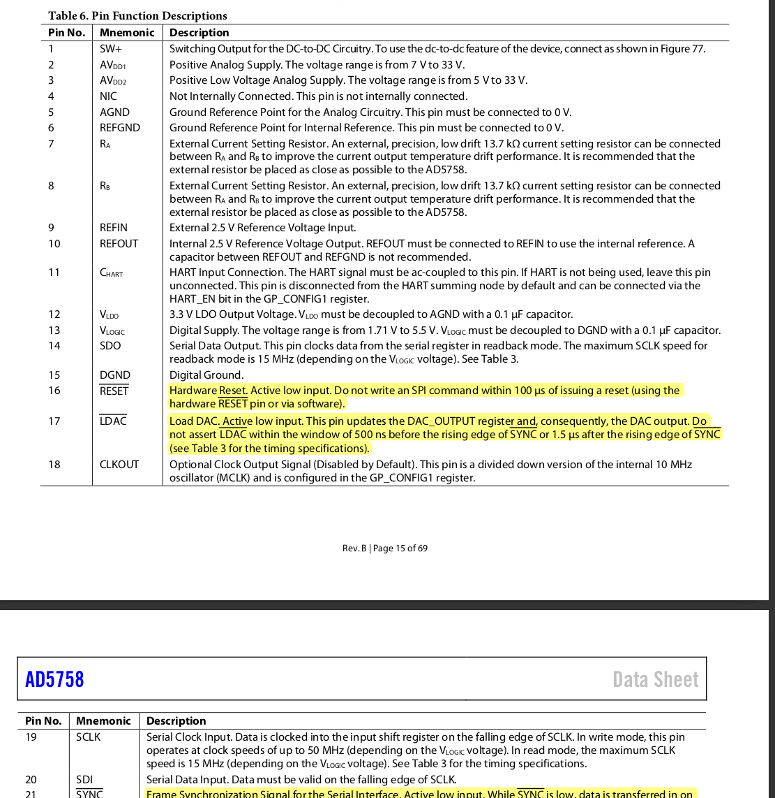
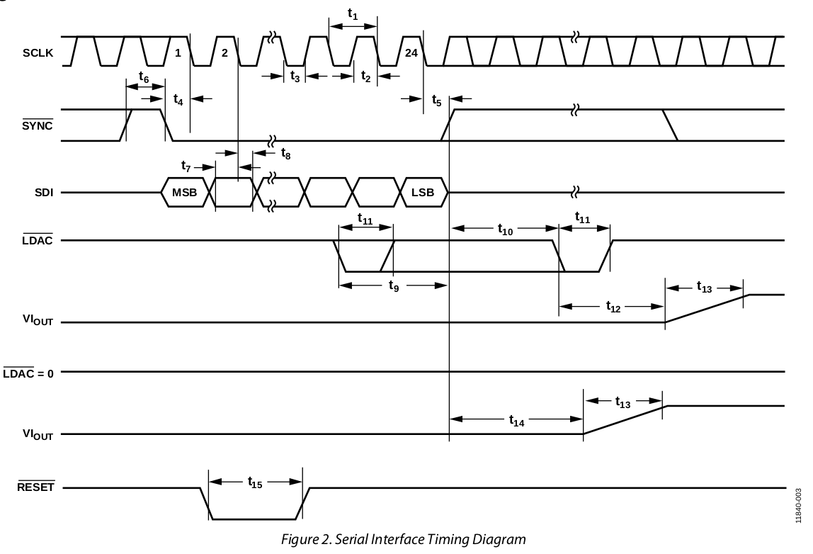

# 数电课设总结

## 同学D
今天终稿截止了，我就说说我自己的想法吧。

这门课被称为自动化之痛。

整体做下来，中间有很多困难。课设类似一个小项目，要编写 FPGA 来控制芯片进行采样和工作。

老师说题目时，我对 VHDL，FPGA 什么都不懂，导致老师布置的任务要求我也听不懂。所以建议学弟学妹在听题之前就去了解一下 FPGA 原理、用途，Quartus II 的使用， VHDL 语言等。

分享一个我觉得写的比较好的介绍 Quartus II 使用的教程

[https://cloud.tencent.com/developer/article/2151669](https://cloud.tencent.com/developer/article/2151669)

VHDL 的话可以去看老师推荐的书：基于 QuartusⅡ 的 FPGACPLD 设计与应用

当时没有录下回放，也不知道老师希望我做什么。后来去问同学，许多同学也跟我一样没搞清楚。但是也有个别听懂了的，再给我讲讲也就懂了。感觉可以多问问同学。之后学弟学妹们的话也可以录一下回放。另外雨课堂的讨论区也是个好地方。

当时寒假，确实也是自己比较懒，配合 AI，现学现用胡乱写了个计算器就当初稿交了。当然也鉴于老师说“有工作量就给分”，而且只占两分所以也没好好写。但实际后来打回了，评语是“工作量不够”。我认为“有工作量”和“工作量不够”是可以并存的吧。但不太敢去和老师理论，毕竟就两分，就算了吧。

后面看了一下同学的代码，才了解了状态机大致写法（主要也是之前一直没去学 VHDL 那本书）。学着把 ADS8364 写了一部分。

同时也开始看数据手册。这是我第一次阅读芯片手册，刚上手门槛挺高的，全英文、各种专有名词以及数据手册的各种格式都不熟悉。但现在看来，阅读数据手册是个艰难但必要的过程。

刚开始看 8364 手册的时候一点都不会读，好在实验室负责电控的队友帮着搜了搜讲了讲，有了一点点认知。就学着队友的方式去搜搜看有没有其他人用过这个芯片，搜一些 pdf、论文之类的去看其他人写的如何使用，可以摘抄到报告里作为参考资料。

这时候大概知道读数据手册要读哪些东西了。要读引脚的各种描述，这些描述往往告诉我们它的作用，以及如何使用。读它的时序图，了解它的时序逻辑。
比如 AD5758 比较重要的可能是下图这块，因为这块是引脚的详细描述。当然后面还有很多引脚的功能解释和时序关系都很重要。

下图这块是 AD5758 的时序图，了解了引脚作用后再看时序图也能比较清晰地了解时间关系。

当我 8364 写的差不多时，估计 5758 的数据手册应该跟 8364 差不多。但读的时候发现它们格式还是有点区别的，应该是不同公司风格也不同，所以还得静下心去啃。配合着 AI，倒是也明白大概需要做什么。再加上 ADS8364 写过状态机了，这一次状态机的撰写相对较快一点。

几乎每次改动后编译代码都会有些语法错误，根本原因是对 VHDL 语言不那么熟悉，就导致了调试时间很长。把报错信息和代码复制给 AI 让其帮助调试，会好一点。

写完三个模块就要设计顶层文件。

[quartus II【如何进行顶层设计】_quartus 自己向下-CSDN 博客](https://blog.csdn.net/m0_37652453/article/details/105326243)

我参考这个博客完成了自己的顶层设计。但是在连接原理图时，原理图上线重合在一起却没有连上了，只是显示成重合到一起了而已。所以波形一直出不来，因为信号就没传递过去。改了很久代码才在原理图的编译报告里看到：warning：XXX 接口没有和 output 连接（原句是英文）

最后是报告的编写方面，为了让代码美观一点我使用了 markdown 编写的。但最后终稿是有格式要求的，如行间距、列间距等等，markdown 生成的 pdf 的行间距可能会跟 word 的有点不同，可能是 markdown 对行的定义与 word 不一样（比如 markdown 伸缩变换显示窗口大小，虽然会改变显示出的行数，但其实只要不换行就是一行），可能会有点问题。
